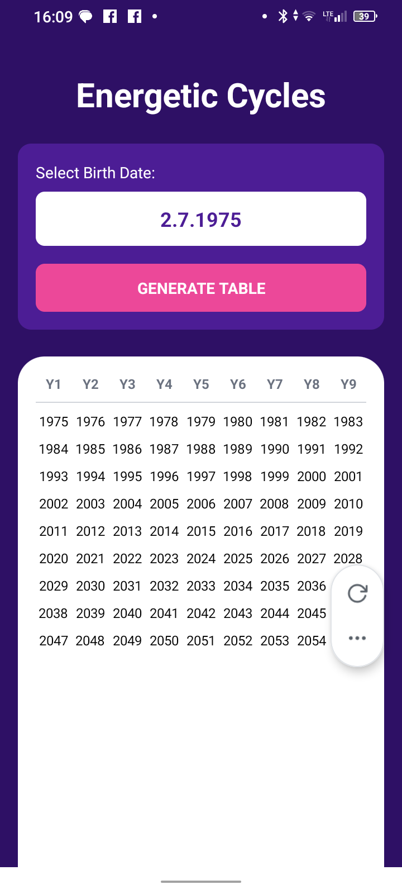
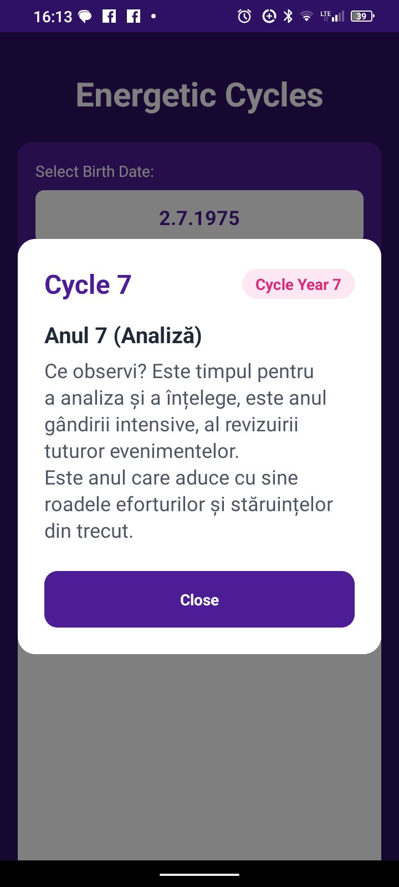

ENERGETIC 9 YEARS CYCLE

1) Features:
   Input: date of birth
   Output: generate a table with 9 years cycle; show meaning for every year

3) Tech: React Native, Typescript, Expo

4) Screenshots

4) Installation

git clone https://github.com/GeoTuxMan/EnergeticCycle.github

cd EnergeticCycle

npm install

npm install -g expo-cli

5) Running the App

npx expo start

6) Testing on Physical Decice

Install Expo Go from App Store (iOS) or Google Play (Android)

Start the development server: npx expo start

Scan the QR code with Expo Go app

7) Building the app (.apk)

npm install -g eas-cli

expo install --check

eas build -p android --profile preview

Download apk file from expo.dev
